![banner.png]
# CyberwatchV1B
The Cyberwatch is an extensible smartwatch built from scratch, targeting ESP32 hardware. It's current version is V1B.
Cyberwatch runs **Cyan**, a small operating system written in C with an embedded Lua runtime for app handling. Cyan is platform agnostic and can run on the watch and as a native desktop application, so the interface can be developed faster, without hardware in the loop by utilising [Clay](<https://github.com/nicbarker/clay>), a lightweight single header UI layout library. Apps are loaded at runtime from an SD card. 
Clay produces layout commands that are
consumed by either an ST7789V2 display handler on hardware or by SDL on a desktop machine. 
Cyan exposes hardware through a service architecture - a registry of
capabilities that apps and core tabs request as needed and can poll availability of arbitrarily. More info can be found with the [Word doc](<docs\Cyberwatch.docx>).

### Major Features
- Lua App Handling
- Watch-face
- Timer
- Stopwatch
- Remote Shell
- Settings

### Instillation
use `git clone --recurse-submodules https://github.com/ttankbuster/CyberwatchV1B.git` for installation, this git-repo uses submodules.

## Contents

## Functionality
|                                          |                                                                                                                                                                                 |
| ---------------------------------------- | ------------------------------------------------------------------------------------------------------------------------------------------------------------------------------- |
| 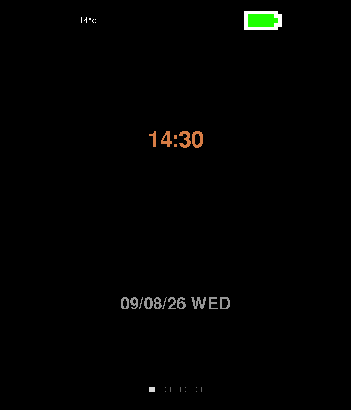 | **Watch face** - has digital and analogue variants. The analogue hands are drawn as quads on the same surface primitive used by apps. Shows the time, day of the week and date. |
| 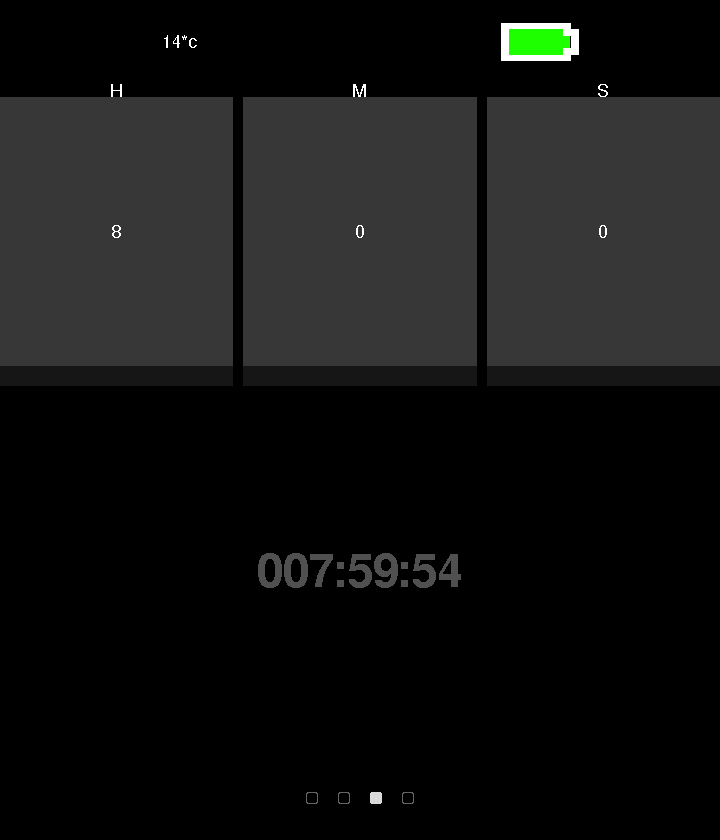          | **Timer** - three spin boxes for hours, minutes and seconds. Button 2 moves between fields, the crown adjusts the value, pressing the crown starts and pauses the timer.        |
| 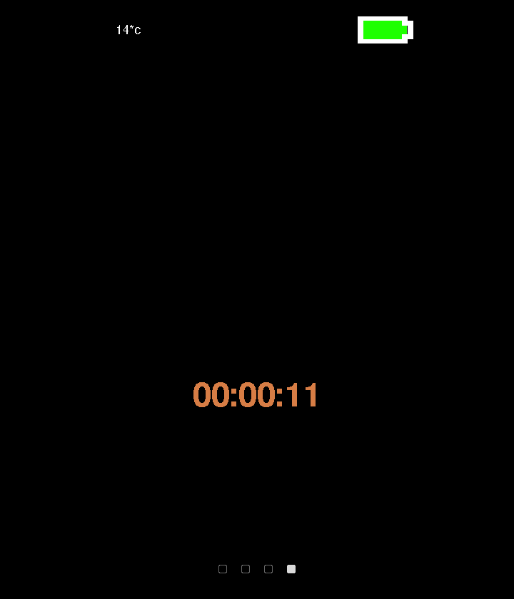  | **Stopwatch** - same interaction model, counting up rather than down.                                                                                                           |
| 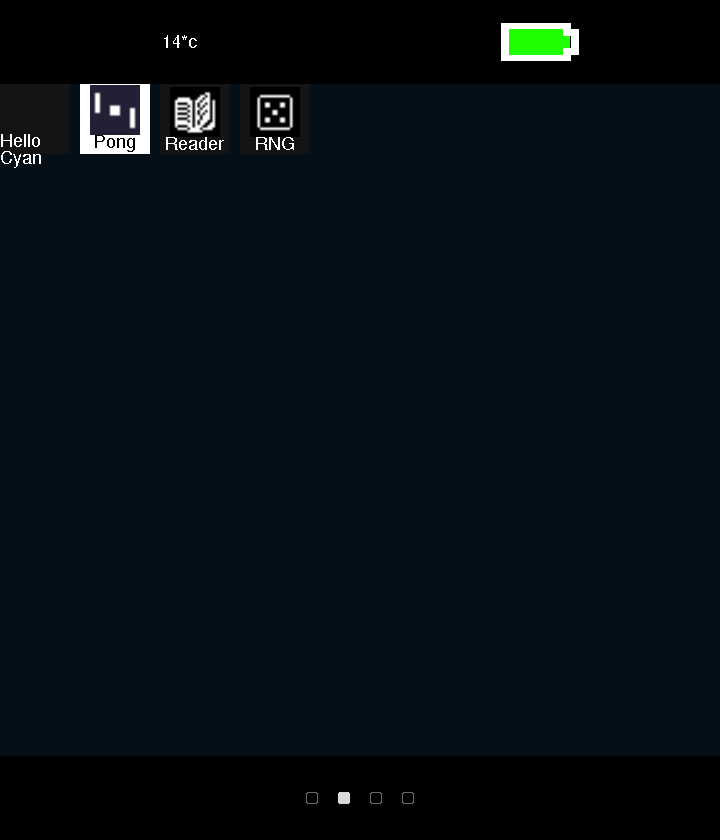       | **App catalogue** - displays a list of apps found on the SD card in rows and launches them.                                                                                     |
| 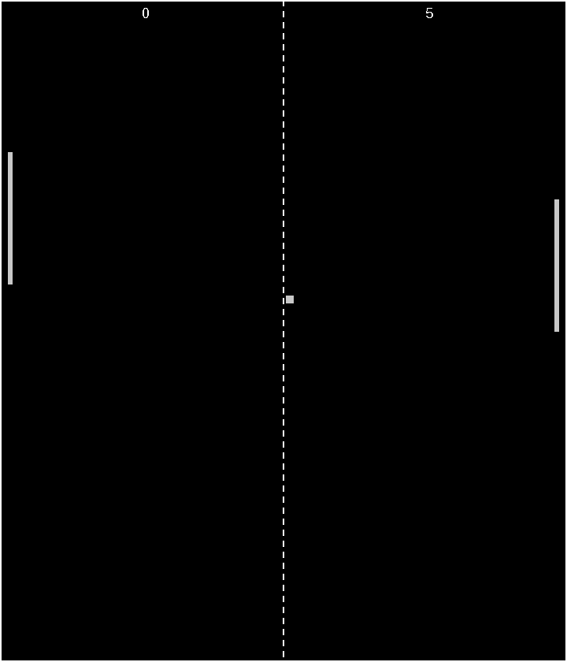         | **Pong** - a demo app written entirely in Lua, using a bespoke app API.                                                                                                         |
## Hardware
|                                                        | Function                      | Part                                                                                     | Interface    | Notes                                                                                                                                    |
| ------------------------------------------------------ | ------------------------------ | ----------------------------------------------------------------------------------------- | ------------ | ------------------------------------------------------------------------------------------------------------------------------------------ |
| 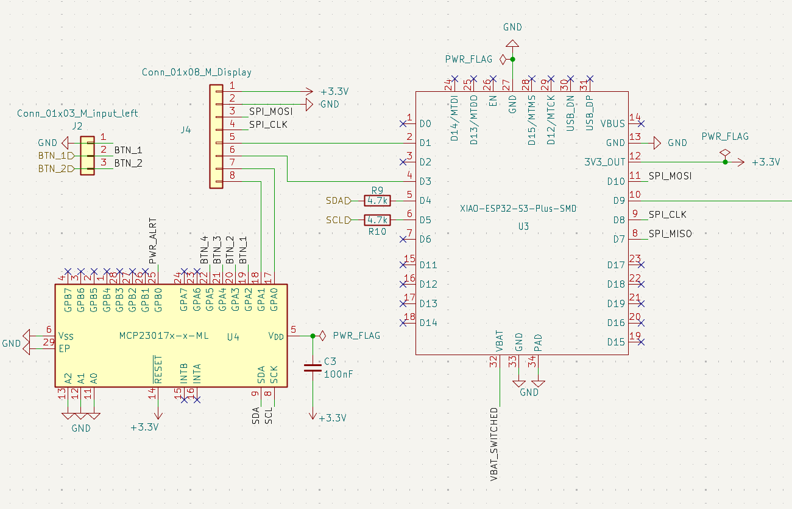                   | MCU                           | Seeed XIAO ESP32-S3 Plus                                                                 | ---          | 240 MHz dual core, 8 MB PSRAM, 16 MB flash, WiFi + BLE 5.0, 14 µA deep sleep, integrated LiPo charging                                   |
|   | Display                       | 1.69” LCD, ST7789V2                                                                      | SPI          | - 240x280 pixel resolution<br>- 39x31.5mm                                                                                                |
| 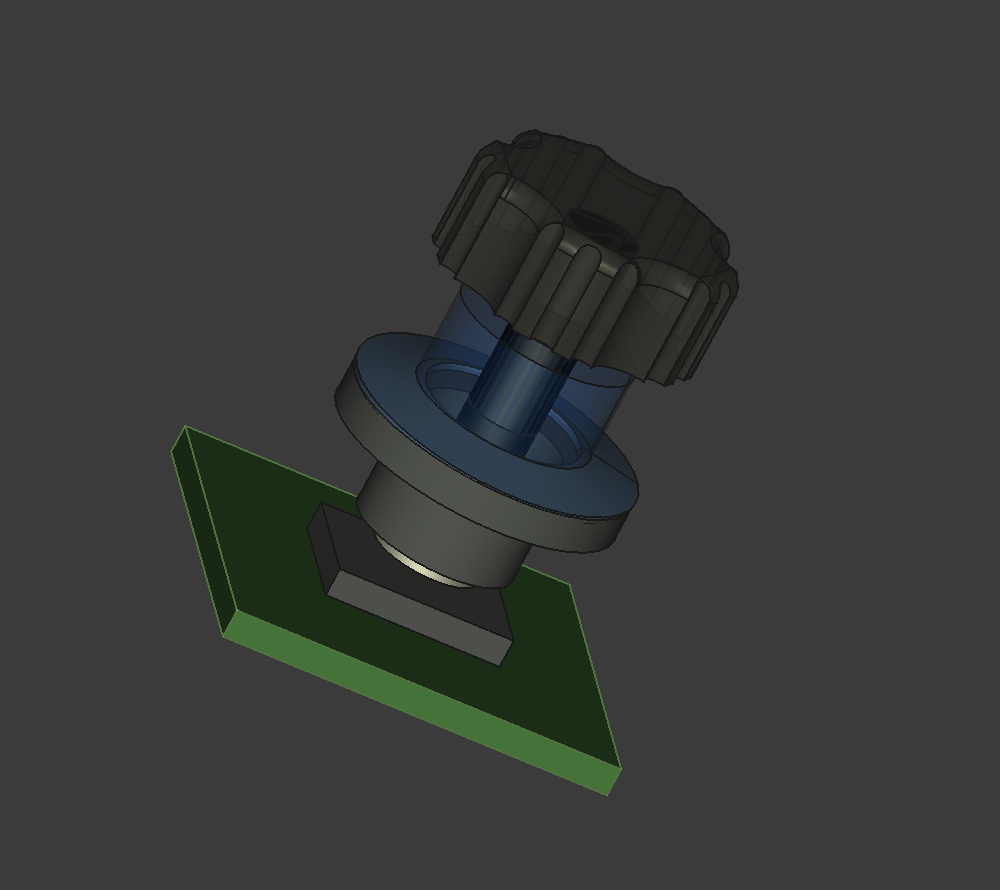          | Crown dial                    | MT6701 magnetic encoder + dipole magnet. Annular Belleville popper for tactile feedback. | I2C          |                                                                                                                                          |
|         | GPIO expansion                | MCP23017                                                                                 | I2C          | Frees ESP32 pins for the crown by moving the display RST and BL lines and the buttons onto the expander.                                 |
| 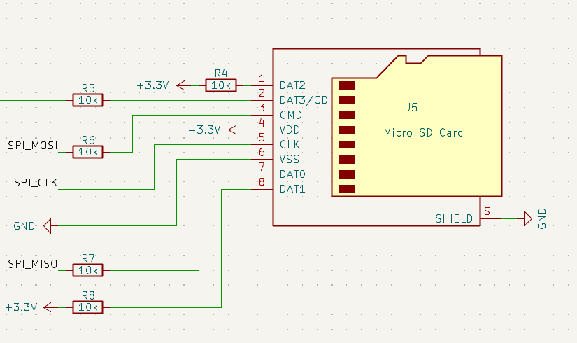               | Storage                       | MicroSD socket                                                                           | SPI          | 10 kΩ pull-ups on CS, MOSI, DAT1, DAT2 and MISO; <br>33 Ω series resistor on VCC to avoid the MCU browning out when the card is inserted |
| 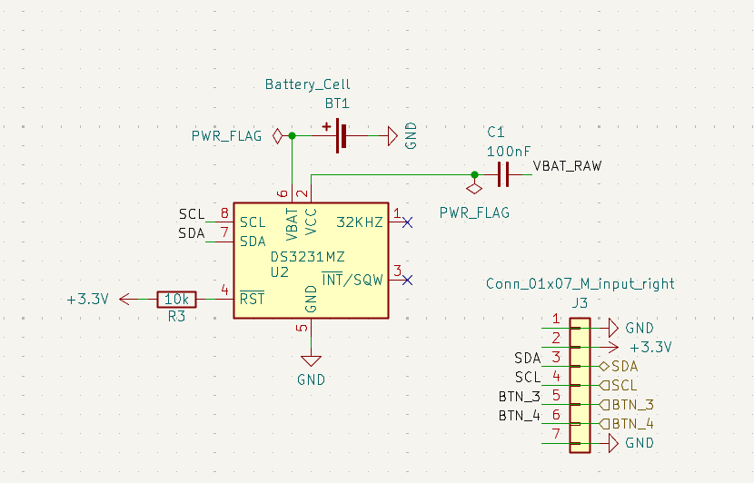                   | Real-time clock & Temperature | DS3231MZ                                                                                 | I2C          | Keeps time across power loss without a WiFi round trip.<br>Source of ambient temperature                                                 |
| 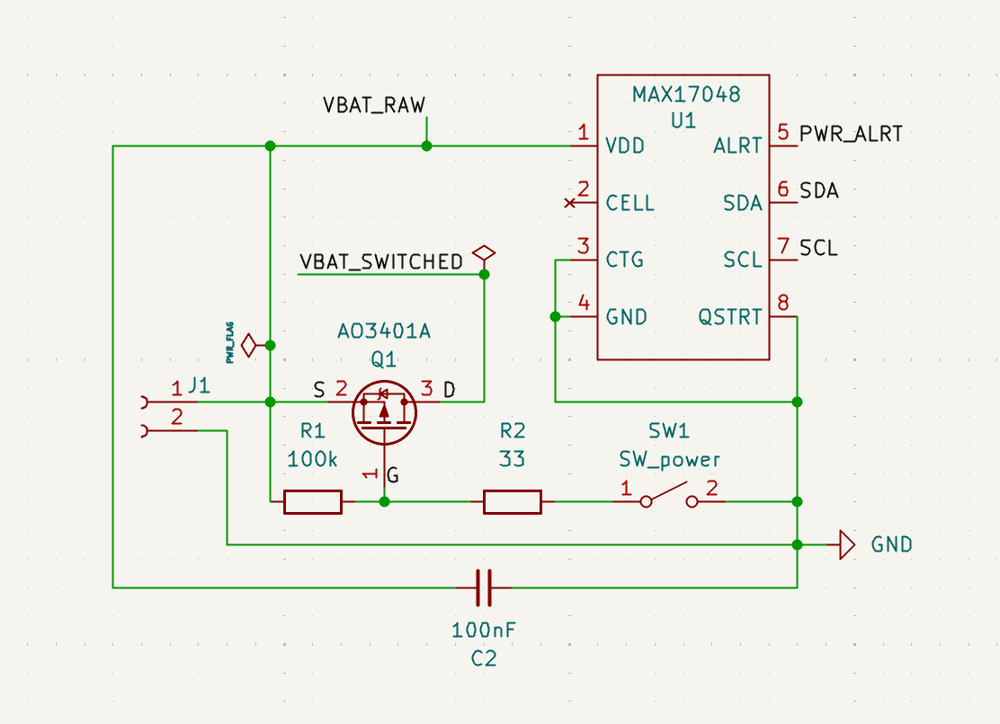         | Battery gauge                 | MAX17048                                                                                 | I2C          |                                                                                                                                          |
| 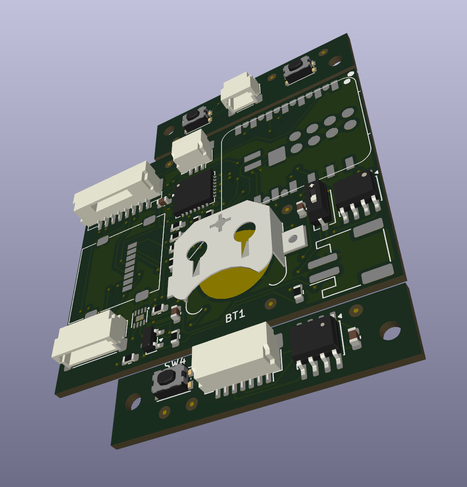                  | Battery                       | 3.7V 500mAh LiPo                                                                         | ---          | JST-PH Connector                                                                                                                         |
| 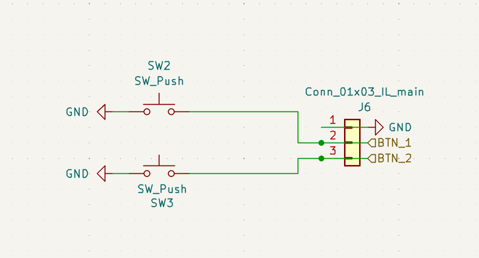               | Buttons                       | 3x tactile switch                                                                        | via MCP23017 | Buttons 1 and 2 on the left; button 4 and the crown on the right.                                                                        |

## Software

The software follows a strict naming convention for all source code for the firmware and CyanOS to keep .

| For           | Naming Convention      |
| ------------- | ---------------------- |
| **types**     | `PascalCase`           |
| **fields**    | `camelCase`            |
| **functions** | `snake_case`           |
| **constants** | `SCREAMING_SNAKE_CASE` |

`design/` holds the KiCad schematic and PCB, a FreeCAD case, component datasheets, and BOM spreadsheets for the hardware.

New public symbols should also take a `cyan_*` prefix. Styling is defined in `.clang-format` (stored at root).

Tests live under `test/`:
- `test/test_cyan_shell/` - Unity-style unit test for the shell command parser.
- `test/test_cyan_shell_repl/` - a Python-driven interactive REPL test, run via `pio test -e shell_repl`.

**PlatformIO Environments**

| Environment         | Hardware Target          | Notes                                                                                                                  |
| -------------------- | -------------------------- | -------------------------------------------------------------------------------------------------------------------- |
| `native`             | Windows PC                | uses SDL3 for window handling and rendering; this environment is used for development and iteration without hardware. |
| `esp32c3`            | Seeed XIAO ESP32-C3       | earlier hardware target, watch-face tab only.                                                                        |
| `esp32s3zero`        | ESP32-S3 DevKitM-1        | full hardware target on a generic S3 dev board.                                                                      |
| `xiao_esp32s3_plus`  | Seeed XIAO ESP32-S3 Plus  | full hardware target for the current CyberwatchV1B board.                                                            |
| `shell_repl`         | Windows PC                | dedicated env for interactively testing the shell command parser in isolation, run with `pio test -e shell_repl`.    |

## Getting Started

Clone with submodules:
```
git clone --recurse-submodules https://github.com/ttankbuster/CyberwatchV1B.git
```
The repo vendors its dependencies (Clay, Lua, SDL3 + `_image`/`_ttf`, and two font families) as git submodules rather than package-manager dependencies, so `--recurse-submodules` is required - a plain clone leaves `external/` and the font folders empty.

To build and run the native simulator:
```
pio run -e native
build/native/program.exe
```
The native simulator has currently only been tested on Windows, where it should run out of the box with PlatformIO's toolchain and the SDL3 DLL installer written in python that checks for an instance of the SDL3 DLLs and coppies them into the executable directory if they are not found. This is to speed up starting on another machine. To target real hardware instead, swap `native` for one of the ESP32 environments above, e.g. `pio run -e xiao_esp32s3_plus -t upload`. This will flash to the ESP32-S3-Plus if it is connected with a usb-c cable, then start the operating system and serial monitor.

### Using the simulator

Launching the `native` build opens two windows: the watch display itself, and a separate console window for the interactive shell.


**Native CyanOS controls (`platform/pc/data_pc.c`)**

| Input                      | Maps to                |
| -------------------------- | ---------------------- |
| Keys `1` / `2` / `3` / `4` | Buttons 1 / 2 / 3 / 4  |
| Mouse middle-click         | Button 3               |
| Scroll wheel up/down       | Crown dial up / down   |
| up/down keys               | Crown dial up / down   |


**Shell commands (`cyan/console/cyan_shell.c`)**

| Command                                        | Does                                                                                                            |
| ------------------------------------------------ | ------------------------------------------------------------------------------------------------------------- |
| `help`                                          | Lists all commands                                                                                             |
| `status`                                        | Shows current Cyan status                                                                                      |
| `app list` / `launch <name>` / `exit`           | Manage apps                                                                                                    |
| `app permission add/remove/list <permission>`   | Manage per-app permissions                                                                                     |
| `screenshot`                                    | Saves a PNG of the current display to `screenshots/`, named by the active tab or running app plus a timestamp |
| `settings get/set/list <setting> [value]`       | Read and write settings                                                                                        |

## Apps

Each app is a folder under `apps/` containing a `.cyan_app.lua` manifest plus its Lua script(s). Five example apps ship in the repo: `pong`, `reader`, `RNG`, `sodoku` and `hello_cyan`.


**Manifest fields (`.cyan_app.lua`)**

| Field    | Meaning                                              |
| -------- | -----------------------------------------------------|
| `name`   | Display name shown in the app catalogue              |
| `script` | Entry-point Lua file, relative to the app's folder   |
| `icon`   | Icon bitmap shown in the catalogue                   |
| `dev`    | If `true`, only loaded in debug builds               |

Example (`apps/pong/.cyan_app.lua`):
```lua
return {
    name = "Pong",
    script = "pong.lua",
    icon = "icon.bmp",
    dev = false
}
```

Apps run sandboxed in their own Lua state and only see the API Cyan registers for them:
- `draw.rect(x, y, w, h, [r, g, b, a])` - filled rectangle
- `draw.text(x, y, text, [fontSize, r, g, b])` - text
- `draw.width()` / `draw.height()` - the app's drawable surface sizes
- `Event` - a table of input event constants (`Event.BUTTON1_DOWN`, `Event.SCROLL_UP`, etc.) for use in an app's event-handling code
- `print(...)` - routed into Cyan's own log output, tagged with the app's name

## Architecture

- **Service registry** (`cyan/data/services.h`) - a `ServiceRegistry` of `Service` entries (time, display, input, storage, power, apps, network, bluetooth, notifications, ...), each with `init`/`update`/`shutdown`/`available` functions and a criticality tier. Apps and core tabs can poll services at runtime.
- **Clay-based UI layer** (`cyan/clay_ui.c`) - an immediate-mode layout pass every frame, using [Clay](https://github.com/nicbarker/clay) to produce render commands consumed by a display backend.
- **`Surface` abstraction** (`cyan/data/surface.h`/`.c`) - a per-app pixel buffer that Lua apps draw into via the `draw` API, kept isolated from the OS's own rendering.
- **Platform backend split** - each platform implements its own `display_*` (rendering) and `data_*` (input/event) backends: `platform/pc/` (SDL3) and `platform/esp32/` (ST7789V2 over SPI via Arduino_GFX, MCP23017 I/O expansion).

The MCP23017 must finish initializing before the display's `RST` pulse, and the SD card's SPI setup must run after the display's own SPI init - reversing either hangs the board.
